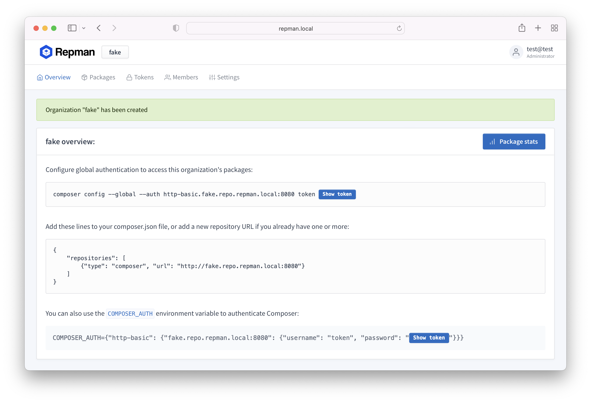

<h1 align=center>Dockette / Repman</h1>

<p align=center>
   🐘 Repmang (packagist proxy and host for private packages)
</p>

<p align=center>
🕹 <a href="https://f3l1x.io">f3l1x.io</a> | 💻 <a href="https://github.com/f3l1x">f3l1x</a> | 🐦 <a href="https://twitter.com/xf3l1x">@xf3l1x</a>
</p>

<p align=center>
  <a href="https://hub.docker.com/r/dockette/repman/"></a>
  <a href="https://bit.ly/ctteg"></a>
  <a href="https://github.com/sponsors/f3l1x"></a>
</p>


-----

## Usage

Latest version: `dockette/repman:1.4.0`

[Example of docker-compose.yml](/docker-compose.yml)

```yaml
version: '3.4'

x-restart-policy: &restart_policy
  restart: unless-stopped

services:
  database:
    << : *restart_policy
    image: postgres:11.7-alpine
    environment:
      POSTGRES_USER: main
      POSTGRES_PASSWORD: main
      POSTGRES_DB: main
    healthcheck:
      test: [ "CMD", "pg_isready", "-q", "-d", "main", "-U", "main" ]
      interval: 10s
      timeout: 5s
      retries: 5
    volumes:
      - .docker/postgres:/var/lib/postgresql/data

  app:
    << : *restart_policy
    image: dockette/repman:1.4.0
    command: /entrypoint-app.sh
    env_file: .env.docker
    ports:
      - 8080:80
    volumes:
      - .docker/app/var:/app/var
      - .docker/nginx/logs:/var/log/nginx
    depends_on:
      database:
        condition: service_healthy

  consumer:
    << : *restart_policy
    image: dockette/repman:1.4.0
    command: /entrypoint-consumer.sh
    env_file: .env.docker
    volumes:
      - .docker/app/var:/app/var
    depends_on:
      - app

  cron:
    << : *restart_policy
    image: dockette/repman:1.4.0
    command: /entrypoint-cron.sh
    env_file: .env.docker
    volumes:
      - .docker/app/var:/app/var
    depends_on:
      - app
```

## Documentation

This repository contains simplified Repman prebuild for Docker.

<p>
    
    
    
</p>

## Development

See [how to contribute](https://contributte.org/contributing.html) to this package.

This package is currently maintaining by these authors.

<a href="https://github.com/f3l1x">
    
</a>

-----

Consider to [support](https://github.com/sponsors/f3l1x) **f3l1x**. Also thank you for using this package.
